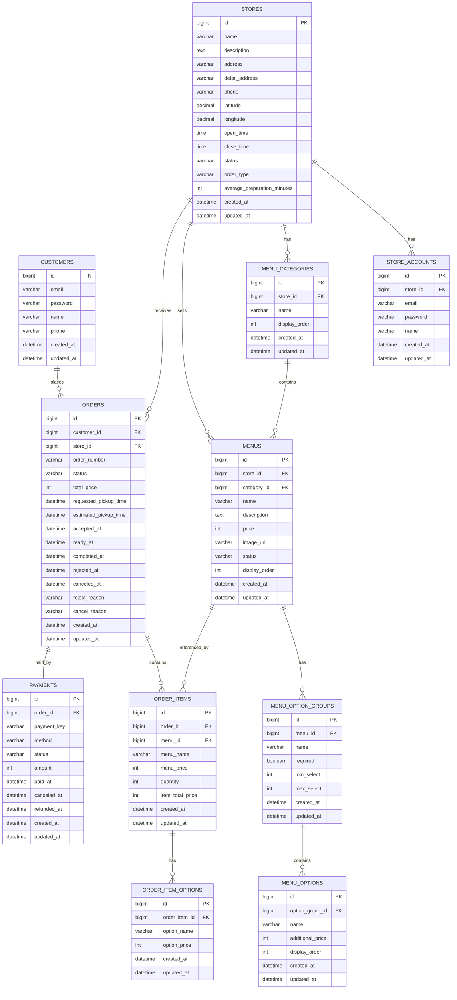

# cafe-pickup-order

카페 픽업 주문 앱의 핵심 흐름을 클론 코딩하며, 고객 앱과 점주 주문 관리 흐름을 직접 구현해보는 MVP 프로젝트입니다.

이 프로젝트는 기존 카페 주문 앱을 참고하여 매장 조회, 메뉴 확인, 앱 주문, 전화 주문, 주문 상태 관리, Mock 결제 등의 주요 기능을 구현하는 것을 목표로 합니다. 단순히 화면을 따라 만드는 것에 그치지 않고, 실제 서비스에서 고객이 주문을 생성하고 점주가 주문을 처리하는 전체 흐름을 Android 앱과 Spring Boot 백엔드로 연결해보는 데 중점을 둡니다.

프론트엔드는 Android Studio에서 Kotlin 기반으로 구현하고, 백엔드는 Spring Boot 기반 REST API로 개발합니다. 이를 통해 모바일 앱과 서버가 실제 서비스처럼 통신하는 구조를 경험하고, 주문 도메인의 상태 전이, 메뉴 옵션 구조, 결제 흐름, 매장별 주문 방식 분기를 설계합니다.

추후에는 앱 주문 가능 매장을 대상으로 사용자의 주문 이력을 활용하여, 자주 주문하는 매장과 메뉴를 앱 실행 직후 작은 팝업 형태로 추천하고 바로 결제까지 이어지는 빠른 주문 기능을 확장할 계획입니다.

---

## 프로젝트 목표

* 카페 픽업 주문 앱의 핵심 사용자 흐름 클론 구현
* Android 앱과 Spring Boot 백엔드 연동 경험
* 고객용 앱 주문 흐름 구현
* 점주용 주문 관리 흐름 구현
* 앱 주문 가능 매장과 전화 주문 가능 매장 분기 처리
* 메뉴, 옵션, 주문, 결제 도메인 설계
* 주문 상태 전이와 예외 상황 처리
* 서버 기반 주문 금액 계산
* Mock 결제 흐름 구현
* DDD 관점에서 주문 도메인 분석 및 모델링
* 추후 개인화 빠른 주문 기능 확장 기반 마련

---

## DDD 학습 목적

이 프로젝트는 단순 CRUD 중심의 구현을 넘어, 카페 픽업 주문 도메인의 흐름을 분석하고 이를 코드 구조에 반영하는 것을 목표로 합니다.

고객, 매장, 메뉴, 주문, 결제는 각각 독립적인 데이터가 아니라 하나의 주문 흐름 안에서 서로 영향을 주는 도메인 개념입니다. 예를 들어 매장의 주문 가능 방식에 따라 주문 생성 가능 여부가 달라지고, 메뉴의 판매 상태와 옵션 선택 규칙에 따라 주문 가능 여부와 최종 금액이 결정되며, 주문 상태는 점주의 처리 과정에 따라 제한된 방향으로만 전이됩니다.

따라서 본 프로젝트에서는 DDD의 관점에서 도메인을 분석하고, 핵심 비즈니스 규칙을 엔티티와 서비스 계층에 명확하게 분리하여 구현하는 것을 목표로 합니다.

주요 학습 포인트는 다음과 같습니다.

* 고객, 매장, 메뉴, 주문, 결제 도메인 간의 관계 파악
* 주문 생성, 주문 접수, 주문 거절, 주문 완료 등 도메인 행위 정의
* 주문 상태 전이 규칙을 도메인 정책으로 관리
* 서버 기반 주문 금액 계산을 통해 비즈니스 규칙 보호
* 메뉴와 옵션의 주문 당시 정보를 스냅샷으로 저장하는 이유 이해
* 앱 주문 가능 매장과 전화 주문 전용 매장의 정책 분리
* 도메인 모델과 DB 테이블을 단순히 1:1로 맞추는 것이 아니라, 실제 서비스 흐름을 기준으로 모델링하는 연습

이 프로젝트를 통해 “테이블을 먼저 설계하고 CRUD를 만드는 방식”이 아니라, 실제 주문 도메인의 규칙과 상태 변화를 먼저 이해한 뒤 이를 객체와 계층 구조로 표현하는 경험을 쌓고자 합니다.

---

## 핵심 구현 범위

### 고객 앱

* 회원가입
* 로그인
* 현재 위치 기반 매장 목록 조회
* 매장 상세 조회
* 매장별 주문 방식 확인
* 메뉴 카테고리 조회
* 메뉴 상세 조회
* 메뉴 옵션 선택
* 장바구니 또는 주문 생성
* Mock 결제
* 주문 상태 조회
* 주문 내역 조회
* 전화 주문 가능 매장 전화 연결

### 점주 기능

* 점주 계정 로그인
* 담당 매장 주문 목록 조회
* 신규 주문 확인
* 주문 접수
* 픽업 준비 완료 처리
* 주문 완료 처리
* 주문 거절 처리
* 메뉴 품절 처리
* 매장 운영 상태 변경

---

## 매장 주문 방식

매장은 주문 방식에 따라 다음과 같이 구분합니다.

| 주문 방식              | 설명                |
| ------------------ | ----------------- |
| `APP_ORDER`        | 앱에서 주문 가능         |
| `PHONE_ORDER_ONLY` | 전화 주문만 가능         |
| `BOTH`             | 앱 주문과 전화 주문 모두 가능 |

이 분기는 차별화 기능이라기보다, 실제 카페 주문 앱에서 제공하는 기본적인 매장 주문 정책을 클론 구현하기 위한 요소입니다.

### 정책

* `APP_ORDER` 매장은 앱에서 메뉴 선택, 옵션 선택, 주문, Mock 결제가 가능합니다.
* `PHONE_ORDER_ONLY` 매장은 앱 주문을 생성하지 않고, 메뉴 확인 후 전화 연결 버튼을 제공합니다.
* `BOTH` 매장은 앱 주문과 전화 주문 버튼을 모두 제공합니다.
* 서버는 `PHONE_ORDER_ONLY` 매장에 대한 앱 주문 생성 요청을 차단합니다.

예외 응답 예시:

```json
{
  "code": "APP_ORDER_NOT_SUPPORTED",
  "message": "이 매장은 앱 주문을 지원하지 않습니다. 전화 주문을 이용해 주세요."
}
```

---

## 주문 상태 흐름

MVP에서는 카페 주문 흐름을 단순화하여 `PREPARING` 상태를 별도로 두지 않습니다.

점주가 주문을 확인하면 곧바로 제조를 시작한다고 보고, `ACCEPTED` 상태로 처리합니다.

### 정상 흐름

```text
REQUESTED → ACCEPTED → READY_FOR_PICKUP → COMPLETED
```

### 예외 흐름

```text
REQUESTED → REJECTED
REQUESTED → CANCELED
```

### 주문 상태 설명

| 상태                 | 설명                      |
| ------------------ | ----------------------- |
| `REQUESTED`        | 고객이 앱에서 주문을 요청한 상태      |
| `ACCEPTED`         | 점주가 주문을 확인하고 제조를 시작한 상태 |
| `READY_FOR_PICKUP` | 제조가 완료되어 픽업 대기 중인 상태    |
| `COMPLETED`        | 고객이 픽업을 완료한 상태          |
| `REJECTED`         | 점주가 주문 요청을 거절한 상태       |
| `CANCELED`         | 주문이 취소된 상태              |

---

## 결제 정책

실제 PG 결제 연동은 MVP 범위에서 제외하고, Mock 결제를 구현합니다.

현장 결제는 앱 서버에서 실제 결제 성공 여부를 정확히 추적하기 어렵기 때문에 관리 대상에서 제외합니다. 따라서 `PAY_AT_STORE` 방식은 사용하지 않고, 앱 내 Mock 결제만 `payments` 테이블에서 관리합니다.

### 결제 방식

| 결제 방식            | 설명         |
| ---------------- | ---------- |
| `MOCK_CARD`      | Mock 카드 결제 |
| `MOCK_KAKAO_PAY` | Mock 카카오페이 |
| `MOCK_NAVER_PAY` | Mock 네이버페이 |

### 결제 상태

| 상태         | 설명       |
| ---------- | -------- |
| `READY`    | 결제 준비 상태 |
| `PAID`     | 결제 완료    |
| `FAILED`   | 결제 실패    |
| `CANCELED` | 결제 취소    |
| `REFUNDED` | 환불 완료    |

---

## 주문 금액 계산 정책

주문 금액은 클라이언트가 전달한 값을 신뢰하지 않습니다.

서버는 주문 요청에 포함된 메뉴 ID와 옵션 ID를 기준으로 DB에서 메뉴 가격과 옵션 추가 금액을 조회한 뒤 최종 금액을 계산합니다.

계산 예시:

```text
아이스 아메리카노 3,000원
+ Grande 옵션 500원
+ 샷 추가 500원
수량 2잔

총 금액 = (3,000 + 500 + 500) × 2 = 8,000원
```

이를 통해 클라이언트 조작으로 인한 금액 변조를 방지합니다.

---

## 주문 스냅샷 저장 정책

메뉴명, 메뉴 가격, 옵션명, 옵션 가격은 주문 당시 값을 별도로 저장합니다.

메뉴 정보는 시간이 지나면서 변경될 수 있습니다. 예를 들어 아메리카노 가격이 3,000원에서 3,500원으로 변경되더라도, 과거 주문 내역은 주문 당시 가격인 3,000원으로 유지되어야 합니다.

이를 위해 주문 생성 시 다음 정보를 스냅샷으로 저장합니다.

* `order_items.menu_name`
* `order_items.menu_price`
* `order_item_options.option_name`
* `order_item_options.option_price`

---

## DDD 적용 방향

본 프로젝트에서는 완전한 DDD 아키텍처를 처음부터 과하게 적용하기보다는, MVP 범위 안에서 도메인 중심 설계를 경험하는 것에 초점을 둡니다.

주문 도메인을 중심으로 다음과 같은 규칙을 코드에 반영합니다.

* 전화 주문 전용 매장은 앱 주문을 생성할 수 없다.
* 품절된 메뉴는 주문할 수 없다.
* 클라이언트가 보낸 금액은 신뢰하지 않고 서버에서 다시 계산한다.
* 주문은 정해진 상태 흐름으로만 변경될 수 있다.
* 주문 당시 메뉴명과 가격은 이후 메뉴 정보가 변경되어도 유지되어야 한다.
* 결제 상태와 주문 상태는 서로 다른 생명주기를 가지므로 분리해서 관리한다.

이를 통해 Controller와 Service에 비즈니스 로직이 흩어지는 구조를 피하고, 주문 도메인의 핵심 규칙을 명확한 책임 단위로 분리하는 것을 목표로 합니다.

---

## ERD



---

## 주요 테이블 설명

### customers

일반 고객 계정 정보를 저장합니다.

### stores

카페 매장 정보를 저장합니다.
매장 위치, 운영 상태, 주문 방식, 평균 제조 시간 등을 관리합니다.

### store_accounts

점주 또는 매장 관리자 계정 정보를 저장합니다.
고객 계정과 분리하여 매장 관리 권한을 명확히 구분합니다.

### menu_categories

매장별 메뉴 카테고리를 저장합니다.

예시:

* 커피
* 논커피
* 디저트

### menus

매장에서 판매하는 메뉴 원본 정보를 저장합니다.
메뉴판 역할을 합니다.

### menu_option_groups

메뉴에 적용 가능한 옵션 그룹을 저장합니다.

예시:

* 사이즈
* 샷 추가
* 얼음량

### menu_options

옵션 그룹 안의 실제 선택지를 저장합니다.

예시:

* Grande +500원
* 샷 추가 +500원
* 얼음 적게 +0원

### orders

고객이 앱 주문 가능 매장에 생성한 주문 정보를 저장합니다.

### order_items

주문에 포함된 개별 메뉴 정보를 저장합니다.
주문 당시 메뉴명과 가격을 스냅샷으로 저장합니다.

### order_item_options

주문 메뉴에 선택된 옵션 정보를 저장합니다.
주문 당시 옵션명과 옵션 가격을 스냅샷으로 저장합니다.

### payments

앱 주문에 대한 Mock 결제 정보를 저장합니다.

---

## 기술 스택

### Android

* Kotlin
* Android Studio
* Jetpack Compose 또는 XML Layout
* Retrofit
* OkHttp
* Kotlin Coroutines
* ViewModel
* StateFlow 또는 LiveData
* Navigation
* 지도 API

### Backend

* Java 17
* Spring Boot
* Spring Security
* Spring Data JPA
* MySQL
* Redis
* SSE
* Swagger
* JUnit5

### Infra

* Docker
* Docker Compose
* GitHub Actions
* Cloud VM 배포

---

## API 설계 초안

### 고객 인증

```http
POST /api/auth/customer/signup
POST /api/auth/customer/login
```

### 점주 인증

```http
POST /api/auth/store/login
```

### 매장

```http
GET /api/stores
GET /api/stores/{storeId}
GET /api/stores/{storeId}/menus
```

### 주문

```http
POST /api/orders
GET /api/orders
GET /api/orders/{orderId}
PATCH /api/orders/{orderId}/cancel
```

### 점주 주문 관리

```http
GET /api/owner/stores/{storeId}/orders
PATCH /api/owner/orders/{orderId}/accept
PATCH /api/owner/orders/{orderId}/ready
PATCH /api/owner/orders/{orderId}/complete
PATCH /api/owner/orders/{orderId}/reject
```

### 점주 메뉴 관리

```http
POST /api/owner/stores/{storeId}/menus
PATCH /api/owner/menus/{menuId}
PATCH /api/owner/menus/{menuId}/sold-out
PATCH /api/owner/menus/{menuId}/on-sale
```

### 실시간 주문 알림

```http
GET /api/owner/stores/{storeId}/orders/stream
```

---

## 예외 처리 예시

### 전화 주문 전용 매장에 앱 주문을 요청한 경우

```json
{
  "code": "APP_ORDER_NOT_SUPPORTED",
  "message": "이 매장은 앱 주문을 지원하지 않습니다. 전화 주문을 이용해 주세요."
}
```

### 품절 메뉴를 주문한 경우

```json
{
  "code": "MENU_SOLD_OUT",
  "message": "품절된 메뉴는 주문할 수 없습니다."
}
```

### 잘못된 주문 상태 변경 요청

```json
{
  "code": "INVALID_ORDER_STATUS",
  "message": "현재 주문 상태에서는 해당 작업을 수행할 수 없습니다."
}
```

---

## 구현 단계

### 1차 MVP

* 고객/점주 인증
* 매장 목록 및 상세 조회
* 매장별 주문 방식 분기
* 메뉴/옵션 조회
* 앱 주문 생성
* Mock 결제
* 주문 상태 변경
* 점주 주문 관리
* 전화 주문 전용 매장 앱 주문 차단

### 2차 개선 기능

* Android 앱 UI 고도화
* SSE 기반 신규 주문 실시간 알림
* 지도 기반 매장 위치 표시
* 현재 위치 기준 거리순 매장 조회
* 혼잡도 기반 예상 픽업시간 계산
* 주문 상태 전이 테스트
* 금액 계산 검증 테스트

### 3차 개인화 기능

앱 주문 가능 매장을 대상으로 사용자의 주문 이력을 활용하여 빠른 주문 기능을 구현합니다.

예상 기능은 다음과 같습니다.

* 사용자가 자주 주문하는 매장과 메뉴 분석
* 앱 실행 직후 자주 주문하는 메뉴 팝업 표시
* 팝업에서 바로 주문 및 결제 진행
* 단순 캐싱 기반 최근 주문 추천
* 추후 AI 기반 개인화 추천으로 확장 가능

예시:

```text
최근 자주 주문한 메뉴
아이스 아메리카노 Grande, 샷 추가

[바로 주문하기]
```

---

## 프로젝트에서 중점적으로 다룰 부분

* 실제 카페 주문 앱의 핵심 흐름 분석
* Android 앱과 Spring Boot 백엔드 연동
* DDD 관점에서 주문 도메인 분석 및 모델링
* 고객 계정과 점주 계정 분리
* 매장별 주문 방식에 따른 화면/API 분기
* 메뉴 옵션 구조 설계
* 주문과 결제 생명주기 분리
* 주문 상태 전이 단순화
* 서버 기반 주문 금액 계산
* 주문 당시 메뉴/옵션 정보 스냅샷 저장
* 추후 개인화 빠른 주문 기능을 위한 주문 이력 데이터 기반 마련

---

## 향후 개선 방향

* 실제 결제 PG 연동
* 쿠폰 및 스탬프 기능
* 리뷰 기능
* 점주 매출 통계 대시보드
* 주문 취소 및 환불 정책 고도화
* 매장별 운영 시간 기반 주문 가능 여부 자동 제어
* 혼잡도 기반 픽업 시간 추천 고도화
* 사용자의 반복 주문 패턴 기반 빠른 주문 추천
* AI 기반 개인화 메뉴 추천

## Commit Rules

* feat: 새로운 기능 추가
* fix: 버그 수정
* docs: 문서 수정
* style: 코드 포맷 정리
* refactor: 코드 구조 개선
* test: 테스트 코드 추가/수정
* chore: 설정, 기타 작업
* build: 빌드/의존성 수정
* ci: CI/CD 설정 수정
* perf: 성능 개선
* revert: 이전 커밋 되돌리기
